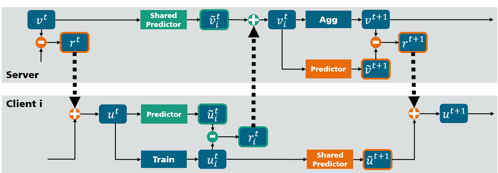

# Code Appendix for ResFed: Residual-based Federated Learning Framework

ResFed is a Residual-based Federated Learning Framework with deep residual compression for both up- or/and down-streaming.

In this code appendix, we provide three main modules as follows:
* **Dataset preprocessing**: Dividing the dataset into a number of clients w.r.t. federated settings
* **ResFed implementation**: Pytorch implementation of Residual-based Federated Learning Framework with deep residual compression
* **Postprocessing**: Visualization of the training results and compression ratio for evaluation.

## Framework Overview




## Installation

### Dependencies

 - Python (3.7)
 - PyTorch (1.8.1)
 - Torchvision (0.9.1)
 - Numpy (1.21.5)

### Install requirements

Run: `pip install -r requirements.txt` to install the required packages.

## Federated Dataset Preprocessing

This preprocessing aims to divide the entire datasets into a dedicated number of clients with respect to federated settings.

Depending on the value of `-c` (the number of classes in each local dataset), the entire dataset are split into Non-IID datasets in terms of label distribution skew.

By calling the function `divide_data()`, one of the used datasets in this paper, i.e. MNIST, CIFAR-10, Fashion-MNIST, SVHN, CIFAR-100 is downloaded via Torchvision automatically.

The module has been integrated into the main functions of ResFed.

## Execute the ResFed

### Test Run

```
python resfed_main.py -n 10 \
                     -m 300 \
                     -c 10 \
                     -lr 0.01 \
                     -bs 64 \
                     -mn 'LeNet' \
                     -ds 'MNIST' \
                     -rd 'results' \
                     -e 1 \
                     -is 1 \
                     -uls 0.95 \
                     -dls 0.95 \
                     -ul 1 \
                     -dl 1 \
                     -qe 1 \
                     -ulp 1 \
                     -dlp 1 \
                     -cw 0
```

### Explanations of Arguments

- `--num_client` `-n`: Number of the clients.
- `--num_comm_round` `-m`: Number of communication rounds.
- `--num_local_class` `-c`: Number of the classes in each client.
- `--lr` `-lr`: Learning rate.
- `--bs` `-bs`: Batch size.
- `--model_name` `-mn`: Model name, e.g. "LeNet", "CNN", "ResNet18", etc.
- `--dataset` `-ds`: Dataset name, one of the following four datasets: "MNIST", "CIFAR-10", "FashionMnist", "SVHN", "CIFAR-100".
- `--res_dir` `-rd`: Directory for the result files, default directory is "./results".
- `--num_epoch` `-e`: Number of local epochs.
- `--i_seed` `-is`: Seed number.
- `--ul_sparsity` `-uls`: Sparsity for deep compression in up-streaming.
- `--dl_sparsity` `-dls`: Sparsity for deep compression in down-streaming.
- `--resfed_upstream` `-ul`: Flag for ResFed in up-streaming.
- `--resfed_downstream` `-dl`: Flag for ResFed in down-streaming.
- `--quan_coef` `-qe`: Quantization coefficient.
- `--ul_proto_id` `-ulp`: Prediction rule of the predictor for up-streaming.
- `--dl_proto_id` `-dlp`: Prediction rule of the predictor for down-streaming.
- `--comp_weight` `-cw`: Flag for model weight compression.


## Evaluation Procedures

Please run `python postprocessing/eval_main.py -rr 'results'` to plot the testing accuracy and training loss by the increasing number of epochs or communication rounds. 
Note that the labels in the figure is the name of result files

